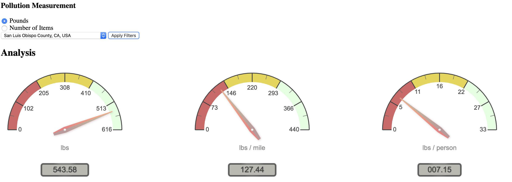

# Ocean Data Challenge 
*Data provided by Booz Allen Hamilton*

1. [Overview](#Overview)
2. [Install and Run](#Install-and-Run)
3. [Abstract](#Abstract)

## Overview

*Thomas Varano, Sagar Saxena, Jasmine Parekh, Thomas Giewont*

We used the data provided by Booz Allen Hamilton to construct an interactive map. This map displays the data and analysis onto an heatmap map highlighting trash cleanup zones. 

This website shows the success of ocean cleanup efforts and allows users to select zones and view a data analysis of that specific zone. The analysis includes the types of trash picked up, the amount of trash that was collected, the density of trash in a certain area, and the efficiency of people in collecting trash. The analysis also compares how cleanup efforts in one zone compare to others and allows users to pinpoint underperforming cleanup efforts. 

## Install and Run

To see the site: 

`git clone git@github.com:tvarano/ocean-pollution.git`

`conda env create -f enviroment.yml` 

`python app.py` 

Then go to http://localhost:5000/

## Abstract

Cleaning our oceans is a major hurdle in making our planet more sustainable. Every year, about 14 billion pounds of trash is dumped into the ocean, of which 242 million pounds of trash are dumped by Americans in plastics alone. In stark contrast to this figure, Americans have only cleaned 12 million pounds of trash in the last decade. The goal of this project is to make trash cleaning more efficient. This project analyzes the Ocean Cleanup Dataset provided by Booz Allen Hamilton to visualize trends in trash cleanup over the last decade, analyze the performance of trash cleanup efforts in each zone and time frame, provide insight into where human resources should be allocated, and provide an accessible interface for volunteers, organizers, and analysts alike in the form of a website. This website displays the data and analysis onto an interactive map highlighting trash cleanup zones. It showcases the success of ocean cleanup efforts and allows users to select zones and view a data analysis of that specific zone. The analysis includes the types of trash picked up, the amount of trash that was collected, the density of trash in a certain area, and the efficiency of people in collecting trash. The analysis also compares how cleanup efforts in one zone compare to others and allows users to pinpoint underperforming cleanup efforts. This website will increase social participation by allowing volunteers to easily find locations where they can help cleanup trash from the oceans, allow organizers and groups to better allocate their efforts to where they can be most effective, and improve the general water quality of the ocean. The visualization of the trash in our oceans may also inspire more volunteers and groups to help clean the oceans and motivate people to be more considerate with their waste.
